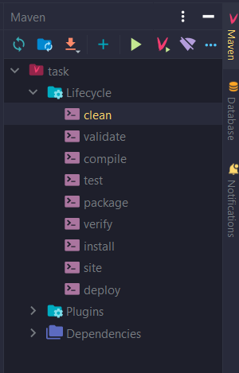

# Calculator
### Before run project
#### Database configuration
* Create database with PostgreSQL, all you need is to run SQL script
that placed in *src/main/resources/static/database-creation-script.sql*
* Connect created database with your project
* Then in *application.properties* file 
change value of fields on yours data 
```
spring.datasource.username=
spring.datasource.password=
```
#### Maven configuration
* Download all dependencies in *pom.xml* file
* Then click on *clean* button


### Running project
* Run Spring Boot application
* Then go to any browser and in search field enter 
`http://localhost:8080/expressions`
